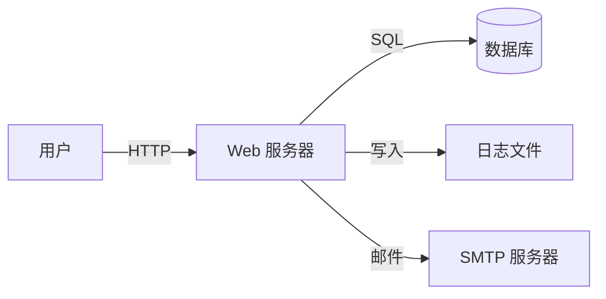
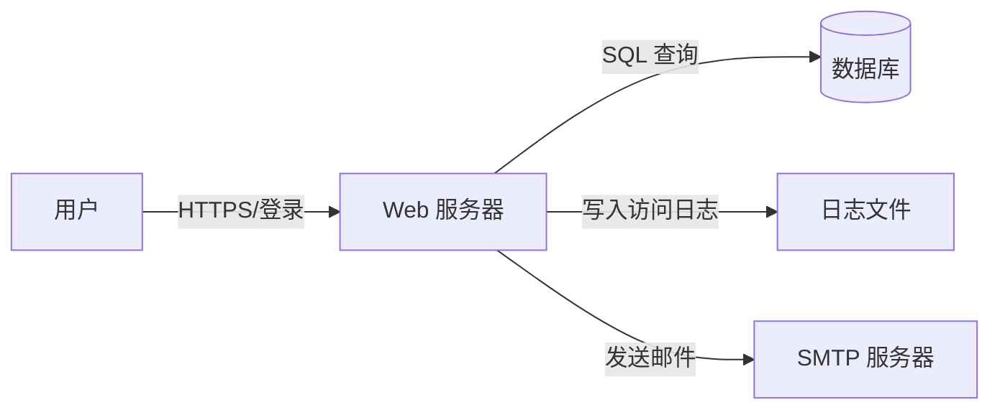

# Day036：Web 安全 - OWASP 与威胁建模基础

- 日期：2026-01-29
- 周次：第6周

## 学习目标
- 理解 OWASP Top 10 范畴与意义
- 掌握简单威胁建模方法

<!--more-->

## 学习内容

### 1️⃣ OWASP Top 10 概览

**OWASP（Open Web Application Security Project）** 是一个全球性的非营利组织，专注于改进 Web 应用程序的安全性。

**OWASP Top 10** 是 Web 应用最关键的安全风险列表，每几年更新一次。最新版本是 2021 版。

| 排名 | 2021 名称 | 风险描述 | 典型场景 |
|------|-----------|-----------|-----------|
| **A01** | 访问控制失效 | 用户可以访问超出其权限范围的数据或功能 | 水平越权/垂直越权/IDOR |
| **A02** | 加密失败 | 使用过时或配置不当的加密方式 | 明文传输密码/使用弱算法 |
| **A03** | 注入 | 未过滤的用户输入被执行为代码/命令 | SQL 注入/XSS/命令注入 |
| **A04** | 不安全设计 | 缺乏安全设计原则或威胁建模 | 业务逻辑漏洞/默认不安全 |
| **A05** | 安全配置错误 | 默认配置或配置不当导致安全风险 | 默认密码/调试信息泄露 |
| **A06** | 易受攻击和过时的组件 | 使用已知漏洞的第三方库 | Log4j2/Spring Framework 漏洞 |
| **A07** | 身份识别和身份验证失效 | 身份验证机制存在缺陷 | 弱密码/暴力破解/会话固定 |
| **A08** | 软件和数据完整性故障 | 未验证数据的完整性和来源 | 不安全的反序列化/CI/CD 篡改 |
| **A09** | 安全日志和监控失效 | 缺乏日志记录或告警机制 | 无法检测攻击/审计失败 |
| **A10** | 服务器端请求伪造（SSRF） | 攻击者通过服务器发起伪造请求 | 访问内网/云元数据窃取 |

---

### 2️⃣ 威胁建模基础

#### 2.1 什么是威胁建模？

**威胁建模**是一种系统化的方法，用于识别、分析和管理应用系统的安全风险。

**目标**：
- 在开发早期发现安全问题
- 确定安全资源的保护策略
- 为安全测试提供指导

**时机**：
- 设计阶段：成本最低，影响最大
- 开发阶段：及时修正
- 部署后：补充完善

---

#### 2.2 常用威胁建模方法

| 方法 | 描述 | 优点 | 缺点 |
|------|------|------|------|
| **STRIDE** | 微软提出的分类法 | 系统化、易于理解 | 需要一定学习成本 |
| **PASTA** | 基于风险的威胁建模 | 面向业务、全面 | 复杂、耗时 |
| **DREAD** | 半定量风险评估 | 简单直观 | 主观性较强 |
| **OWASP ASVS** | 安全控制验证标准 | 覆盖面广 | 检查项目多 |

---

#### 2.3 STRIDE 方法详解

STRIDE 是最常用的威胁建模分类法，代表 6 类威胁：

| 威胁类型 | 说明 | Web 应用示例 | 防御措施 |
|---------|------|------------|---------|
| **S**poofing | 伪装：攻击者冒充他人 | 伪造登录/CSRF 请求 | 双因素认证/CSRF Token |
| **T**ampering | 篡改：修改数据或代码 | 修改 HTTP 请求/篡改参数 | 加密传输/完整性校验 |
| **R**epudiation | 否认：否认行为 | 删除日志/无审计记录 | 不可篡改日志/审计追踪 |
| **I**nformation Disclosure | 信息泄露：敏感数据暴露 | 错误信息/目录遍历 | 最小权限/输入验证 |
| **D**enial of Service | 拒绝服务：系统不可用 | 资源耗尽攻击/DoS | 限流/负载均衡 |
| **E**levation of Privilege | 权限提升：获得更高权限 | 越权访问/提权漏洞 | 最小权限原则/访问控制 |

---

#### 2.4 威胁建模流程

**标准流程**：

```
1. 定义范围
   ├─ 确定应用边界
   ├─ 识别关键资产（数据、功能、组件）
   └─ 绘制数据流图（DFD）

2. 分解系统
   ├─ 识别信任边界
   ├─ 识别外部实体
   └─ 识别数据存储和流动

3. 识别威胁
   ├─ 使用 STRIDE 检查每个元素
   ├─ 识别可能的攻击路径
   └─ 记录威胁清单

4. 分析和评估
   ├─ 评估影响和可能性
   ├─ 计算风险等级
   └─ 确定优先级

5. 制定缓解策略
   ├─ 选择控制措施
   ├─ 实施安全控制
   └─ 验证有效性

6. 验证和更新
   ├─ 持续监控
   ├─ 定期重新评估
   └─ 更新威胁模型
```

---

#### 2.5 数据流图（DFD）示例

**示例应用**：电商网站登录功能

```
[用户] --HTTP--> [Web 服务器] --SQL--> [数据库]
                    |
                    v
              [日志文件]
```

**威胁分析**：

| 元素 | 威胁类型 | 描述 | 缓解措施 |
|------|---------|------|---------|
| 用户→Web 服务器 | Spoofing | 伪造登录请求 | CSRF Token + 验证码 |
| Web 服务器 | Tampering | 修改请求参数 | HTTPS + 参数签名 |
| Web 服务器→数据库 | Information Disclosure | SQL 注入泄露数据 | 参数化查询 |
| 日志文件 | Information Disclosure | 敏感信息记录日志 | 日志脱敏 |

## 实践任务（合法授权范围内）

> **重要提醒**：以下实践仅在本地自建靶场或授权测试环境中进行。严禁对未授权目标进行任何测试。

---

### 任务 1（必做）：为一个示例应用做威胁建模

**目标**：为简单的 Web 应用（如 DVWA/Pikachu/自建 Demo）创建威胁模型。

**步骤**：

**1. 绘制数据流图**

使用工具（如 draw.io、Visio、手绘）绘制应用的 DFD：



**2. 使用 STRIDE 分析每个元素**

| 元素 | S | T | R | I | D | E | 威胁描述 |
|------|---|---|---|---|---|---|----------|
| 用户输入 | ✅ | ✅ | | ✅ | | | 伪装/篡改/信息泄露 |
| Web 服务器 | | ✅ | | ✅ | ✅ | ✅ | 篡改/泄露/拒绝服务/提权 |
| 数据库 | | ✅ | | ✅ | ✅ | ✅ | 篡改/泄露/拒绝服务/提权 |
| 日志文件 | | ✅ | ✅ | | | | 篡改/否认 |
| SMTP 服务器 | | | | | | | |

**3. 识别关键威胁并评估风险**

使用 **DREAD** 方法评估风险：

**DREAD 公式**：
```
Risk = (Damage + Reproducibility + Exploitability + Affected Users) / 4
```

| 威胁 | Damage (1-10) | Reproducibility (1-10) | Exploitability (1-10) | Affected Users (1-10) | Risk (0-10) | 优先级 |
|------|----------------|----------------------|----------------------|---------------------|-------------|-------|
| SQL 注入 | 10 | 8 | 9 | 10 | 9.25 | 🔴 高 |
| XSS | 7 | 7 | 8 | 10 | 8.0 | 🔴 高 |
| CSRF | 5 | 6 | 7 | 10 | 7.0 | 🟡 中 |
| 暴力破解 | 4 | 10 | 10 | 10 | 8.5 | 🔴 高 |
| 目录遍历 | 6 | 7 | 8 | 8 | 7.25 | 🟡 中 |

**4. 制定缓解策略**

| 威胁 | 缓解措施 | 实施优先级 |
|------|---------|-----------|
| SQL 注入 | 参数化查询 + ORM | P0 |
| XSS | 输出编码 + CSP | P0 |
| CSRF | Anti-CSRF Token | P1 |
| 暴力破解 | 速率限制 + 多因素认证 | P1 |
| 目录遍历 | 路径验证 + 权限控制 | P1 |

---

### 任务 2（必做）：输出风险与缓解策略列表

**目标**：将威胁建模结果整理成结构化报告。

**报告模板**：

```markdown
# [应用名称] 威胁建模报告

## 1. 应用概述
- 应用名称：[Demo Web App]
- 应用类型：[电商/社交/企业应用]
- 调研日期：[2026-01-29]
- 建模人员：[姓名]

## 2. 系统边界
### 2.1 信任边界
- 用户 → Web 服务器（不信任边界）
- Web 服务器 → 数据库（信任边界）
- Web 服务器 → 外部 API（不信任边界）

### 2.2 数据流图
[插入 DFD 图片或 mermaid 代码]

## 3. 资产清单
| 资产类型 | 资产名称 | 保密性要求 | 完整性要求 | 可用性要求 |
|---------|---------|-----------|-----------|-----------|
| 数据 | 用户个人信息 | 高 | 高 | 中 |
| 数据 | 交易记录 | 高 | 高 | 高 |
| 功能 | 支付接口 | 高 | 高 | 高 |
| 功能 | 用户注册 | 中 | 中 | 高 |

## 4. 威胁清单（STRIDE）
| ID | 威胁类型 | 影响组件 | 描述 | 风险等级 |
|----|---------|---------|------|---------|
| T001 | Injection | 登录模块 | SQL 注入导致数据泄露 | 高 |
| T002 | Spoofing | 支付模块 | 伪造支付请求 | 高 |
| T003 | Tampering | 用户信息 | 篡改用户数据 | 中 |

## 5. 缓解策略
| 威胁ID | 缓解措施 | 实施状态 | 负责人 | 截止日期 |
|--------|---------|---------|--------|---------|
| T001 | 参数化查询 + 输入验证 | 待实施 | 张三 | 2026-02-05 |
| T002 | 请求签名 + 双因素认证 | 待实施 | 李四 | 2026-02-05 |

## 6. 持续监控计划
- 每周：安全扫描
- 每月：威胁模型更新
- 每季度：渗透测试
```

---

### 任务 3（选做）：使用 OWASP Threat Dragon 工具

**目标**：使用专业的威胁建模工具创建模型。

**步骤**：

1. **安装 OWASP Threat Dragon**
   
   - 访问：https://owasp.org/www-community/threat-dragon/
   - 在线版本：https://www.threatdragon.com/
   - 本地版本：https://github.com/OWASP/threat-dragon/releases

2. **创建新项目**
   
   ```
   项目名称：Demo Web App Threat Model
   描述：演示应用的威胁建模
   模型类型：STRIDE
   ```

3. **绘制威胁模型**
   
   - 添加数据存储（Database）
   - 添加数据流（箭头）
   - 添加进程（Web Server）
   - 添加外部实体（User）

4. **自动生成威胁报告**
   
   - 使用工具的自动分析功能
   - 导出为 PDF/JSON 格式

---

## 巩固练习（题与复盘）

---

### 练习 1：为何需要威胁建模？

**思路提示**：

- 安全问题的成本曲线
- 早期发现 vs 晚期修复
- 被动防御 vs 主动预防
- 安全左移（Shift-Left）理念

**参考答案**：

1. **成本优势**：
   - 设计阶段修复成本：$1
   - 开发阶段修复成本：$5-10
   - 测试阶段修复成本：$50-100
   - 生产环境修复成本：$500-1000+ （还可能包括数据泄露损失）

2. **安全左移**：
   - 传统：代码写完后才做安全测试
   - 现代：在设计阶段就考虑安全

3. **系统性防护**：
   - 避免随机性测试
   - 覆盖所有攻击面
   - 确定优先级

---

### 练习 2：完善模型中的证据项

**任务**：为威胁模型中的每个威胁添加证据项。

**证据类型**：

| 证据类型 | 说明 | 示例 |
|---------|------|------|
| 截图 | 功能界面/错误信息 | 登录界面截图 |
| 流量抓包 | HTTP 请求/响应 | Burp Suite 抓包 |
| 代码片段 | 漏洞代码 | SQL 注入 Payload |
| 日志 | 应用日志/系统日志 | 错误日志 |

**模板**：

```markdown
### T001: SQL 注入
- 威胁描述：登录接口存在 SQL 注入漏洞
- 影响范围：用户数据泄露/数据篡改
- 证据：
  - [ ] 功能截图：`images/day036_login.png`
  - [ ] 抓包证据：`images/day036_sqli_payload.pcap`
  - [ ] 响应截图：`images/day036_sqli_response.png`
  - [ ] 数据库查询日志：`images/day036_db_log.png`
```

---

### 练习 3：使用 STRIDE 分析一个真实场景

**场景**：用户密码重置功能

**分析步骤**：

1. **绘制数据流**：
   ```
   [用户] → [Web 应用] → [邮件服务器] → [用户邮箱]
              ↓
           [数据库]
   ```

2. **STRIDE 分析**：

| 威胁类型 | 是否适用 | 具体风险 | 缓解措施 |
|---------|---------|---------|---------|
| S | ✅ | 攻击者伪造密码重置请求 | 验证码/身份验证 |
| T | ✅ | 篡改重置链接 | HTTPS + 链接签名 |
| R | ✅ | 否认发起重置请求 | 审计日志 |
| I | ✅ | 泄露敏感信息（重置 Token） | Token 加密/短有效期 |
| D | ✅ | 拒绝服务（大量重置请求） | 速率限制 |
| E | ✅ | 权限提升（重置他人密码） | 身份验证/多因素认证 |

---

## 评估标准（达成判定）

- ✅ 完成了示例应用的威胁建模（DFD + STRIDE）
- ✅ 使用 DREAD 方法评估了风险等级
- ✅ 制定了缓解策略清单并标注优先级
- ✅ 输出了结构化威胁建模报告
- ✅ （可选）使用了 OWASP Threat Dragon 等工具

## 学习成果达成情况（由学习者填写）

---

### 截图与证据

- [ ] 数据流图（DFD）截图或绘图
- [ ] STRIDE 威胁分析表格
- [ ] DREAD 风险评估表格
- [ ] 威胁建模报告（Markdown/PDF）
- [ ] （可选）OWASP Threat Dragon 工具截图

---

### 关键命令与输出（粘贴关键片段）

**使用 OWASP Threat Dragon 创建威胁模型**：

```bash
# 在线版本：访问 https://www.threatdragon.com/
# 本地版本（如果已安装）：
threat-dragon-desktop

# 导出报告
File → Export → PDF/JSON
```

**绘制数据流图（使用 Mermaid）**：



**DREAD 风险计算示例**：

```python
# 风险计算脚本示例
def dread_score(damage, reproducibility, exploitability, affected_users):
    return (damage + reproducibility + exploitability + affected_users) / 4

# SQL 注入风险评估
risk_sqli = dread_score(10, 8, 9, 10)  # 9.25 (高)
print(f"SQL 注入风险等级: {risk_sqli:.2f}")

# CSRF 风险评估
risk_csrf = dread_score(5, 6, 7, 10)  # 7.0 (中)
print(f"CSRF 风险等级: {risk_csrf:.2f}")
```

---

### 结论与反思

**我今天搞清楚了**：

- OWASP Top 10 是 Web 安全的"考试大纲"，覆盖了最常见的 10 类安全风险
- 威胁建模是"安全左移"的核心，在设计阶段识别风险比上线后修复成本低 10-100 倍
- STRIDE 是一个系统化的威胁分类法（S/T/R/I/D/E），帮助避免遗漏攻击面
- DREAD 是半定量的风险评估方法，通过评分确定威胁的优先级
- 数据流图（DFD）是威胁建模的基础，必须清晰地标注信任边界和数据流向

**我差点搞混的是**：

- 最初混淆了"威胁"和"漏洞"：
  - **威胁**：可能导致不良事件的潜在原因（"谁可能攻击"）
  - **漏洞**：系统中可被利用的弱点（"哪里有漏洞"）
- 不清楚 STRIDE 中各个类型的具体示例：
  - Repudiation 指的是"否认行为"（如删除日志），不是"拒绝服务"（DoS）
  - Elevation of Privilege 指的是"权限提升"，包括垂直越权和水平越权
- DREAD 评分的主观性较强，需要团队共同评审以减少偏差

**明天我要继续补的是**：

- 深入学习 OWASP Top 10 的具体漏洞类型（Day037-Day041）
- 了解不同威胁建模工具的使用（如 Microsoft Threat Modeling Tool）
- 实践 SQL 注入和 XSS 的具体攻击与防御（Day038）
- 学习如何编写安全需求和安全测试用例

**本次学习耗时**：约 3 小时

**掌握程度自评**：

- [ ] 😕 理解了基本概念，但实践不熟练
- [ ] 🙂 完成了威胁建模文档，理解了 STRIDE
- [ ] 😃 完成了所有任务并理解原理
- [ ] 🤩 额外使用了专业工具（Threat Dragon）并分析复杂场景

---

## 集中参考答案（含思路）

---

### 练习 1 参考答案：为何需要威胁建模？

**核心理由**：

1. **成本优势**：
   ```
   修复成本随阶段呈指数增长：
   设计阶段：$1
   开发阶段：$5-10
   测试阶段：$50-100
   生产环境：$500-1000+ （可能包括数据泄露、法律诉讼、品牌损失）
   ```

2. **安全左移（Shift-Left）理念**：
   - 传统模式：开发完成 → 安全测试 → 发现问题 → 修复（耗时、成本高）
   - 现代模式：需求设计 → 威胁建模 → 安全编码 → 测试验证（效率高、成本低）

3. **系统性防护**：
   - 避免随机性测试（可能遗漏关键攻击面）
   - 覆盖所有组件和信任边界
   - 确定修复优先级（基于风险而非随意）

4. **团队沟通**：
   - 统一安全语言（STRIIDE/DREAD/OWASP Top 10）
   - 促进开发、测试、安全团队的协作
   - 形成可复用的安全知识库

**一句话总结**：
> 威胁建模是在设计阶段"预演"攻击，用低成本的思维实验替代高成本的实战教训。

---

### 练习 2 参考答案：完善模型中的证据项

**证据收集要点**：

| 证据类型 | 收集时机 | 收集方式 | 存储格式 |
|---------|---------|---------|---------|
| 功能截图 | 正常操作 | 截图工具 | PNG/JPG |
| 异常截图 | 漏洞触发 | 截图工具 | PNG/JPG |
| HTTP 流量 | 请求/响应 | Burp Suite/Wireshark | PCAP/JSON |
| 代码片段 | 漏洞复现 | IDE/文本编辑器 | TXT/MD |
| 数据库日志 | SQL 注入 | 数据库客户端 | TXT/JSON |
| 应用日志 | 后台操作 | tail/follow | TXT/JSON |

**证据命名规范**：
```
day[036]_[威胁类型]_[步骤]_[时间戳].[扩展名]
示例：
- day036_sqli_login_payload_20260129.png
- day036_sqli_response_20260129.json
- day036_csrf_token_missing_20260129.png
```

---

### 练习 3 参考答案：密码重置功能的 STRIDE 分析

**完整威胁矩阵**：

| 威胁类型 | 适用性 | 具体场景 | 攻击路径 | 风险评分 | 缓解措施 |
|---------|-------|---------|---------|---------|---------|
| Spoofing | ✅ | 伪造密码重置请求 | 攻击者冒充受害者发起重置 | 高 | 验证码/多因素认证 |
| Tampering | ✅ | 篡改重置链接 | 攻击者修改链接中的 Token | 高 | HTTPS + 链接签名 |
| Repudiation | ✅ | 否认发起重置 | 攻击者否认是其发起的 | 中 | 不可篡改的审计日志 |
| Information Disclosure | ✅ | 泄露重置 Token | 日志/响应中暴露 Token | 高 | Token 加密 + 最小日志 |
| Denial of Service | ✅ | 大量重置请求 | 攻击者发起 DoS 攻击 | 中 | 速率限制 + 验证码 |
| Elevation of Privilege | ✅ | 重置他人密码 | 攻击者重置管理员密码 | 高 | 身份验证 + 多因素认证 |

**关键安全控制**：

1. **身份验证**：
   - 必须验证用户身份（邮箱/手机/安全问题）
   - 不允许仅凭用户名发起重置

2. **Token 安全**：
   - 随机生成（至少 128 位熵）
   - 短有效期（通常 15-30 分钟）
   - 单次使用（使用后立即失效）

3. **防止枚举**：
   - 无论用户是否存在都返回相同响应
   - 延迟响应时间（防止批量枚举）

4. **速率限制**：
   - 限制单个 IP/邮箱的请求频率
   - 超过阈值触发验证码

---

## 学习成果示例填写（可照抄）

> 可将"示例"内容替换为你自己的时间与截图文件名。

---

### 截图与证据（示例）

- 数据流图：`images/day036_data_flow.png`
- STRIDE 分析：`images/day036_stride_table.png`
- DREAD 风险评估：`images/day036_dread_scores.png`
- 威胁建模报告：`docs/day036_threat_model_report.md`

---

### 关键命令与输出（示例）

**威胁模型导出为 JSON（Threat Dragon 格式）**：

```json
{
  "summary": {
    "title": "Demo Web App Threat Model",
    "owner": "Team A",
    "description": "Example web application threat modeling"
  },
  "detail": {
    "diagrams": [
      {
        "title": "High Level DFD",
        "diagramType": "STRIDE",
        "elements": [
          {
            "id": "e1",
            "type": "actor",
            "text": "User"
          },
          {
            "id": "e2",
            "type": "process",
            "text": "Web Server"
          },
          {
            "id": "e3",
            "type": "store",
            "text": "Database"
          }
        ],
        "flows": [
          {
            "source": "e1",
            "target": "e2",
            "text": "HTTPS"
          },
          {
            "source": "e2",
            "target": "e3",
            "text": "SQL Query"
          }
        ]
      }
    ]
  }
}
```

---

### 结论与反思（示例）

**我今天搞清楚了**：

- 威胁建模是"安全左移"的核心，在设计阶段识别风险的成本远低于生产环境
- STRIDE 的 6 类威胁帮助系统化地覆盖所有攻击面
- DREAD 评分需要团队评审以减少主观偏差
- 数据流图（DFD）必须清晰标注信任边界，这是威胁分析的基础

**我差点搞混的是**：

- 最初混淆了 Repudiation（否认行为）和 Denial of Service（拒绝服务）
- 不清楚 Elevation of Privilege 包括垂直越权和水平越权两种类型
- DREAD 评分的主观性问题需要通过团队评审来解决

**明天我要继续补的是**：

- 学习身份认证与会话安全的详细实现（Day037）
- 了解 CSRF 的攻击原理和防御策略
- 实践 SQL 注入和 XSS 的具体攻击与防御（Day038）

**本次学习耗时**：约 3 小时

**掌握程度自评**：

- [x] 😃 完成了所有任务并理解原理
