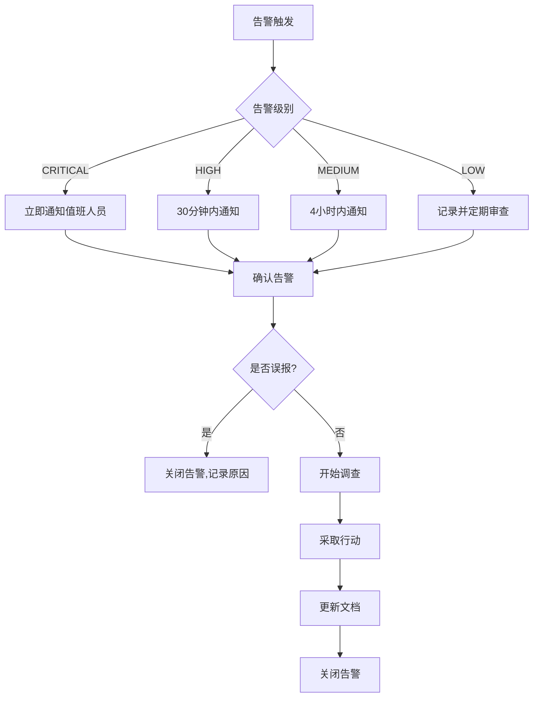
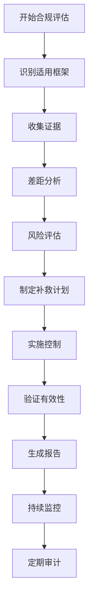

# Day068：云与容器安全 - 云审计与告警、合规参考

- 日期：2026-03-02
- 周次：第10周

## 学习目标

今天你将掌握云安全监控和合规管理：

- **配置审计日志**：启用和配置云审计服务
- **设置告警规则**：实现安全事件告警
- **理解合规框架**：了解主要合规标准和最佳实践
- **实施监控策略**：建立全面的安全监控体系
- **响应安全事件**：建立事件响应流程

---

<!--more-->

## 学习内容

### 1️⃣ 云审计配置

#### 1.1 AWS CloudTrail 配置

```python
#!/usr/bin/env python3
"""
云审计配置管理
"""
from __future__ import annotations
from dataclasses import dataclass
from datetime import datetime
from typing import Optional, list


@dataclass
class AuditTrailConfig:
    """审计跟踪配置"""
    trail_name: str
    s3_bucket: str
    include_global_events: bool
    log_validation: bool
    encryption_key: str
    multi_region: bool
    is_organization_trail: bool


@dataclass
class LogEvent:
    """日志事件"""
    event_id: str
    event_time: datetime
    event_name: string
    user_identity: dict
    source_ip: string
    aws_region: string
    request_parameters: dict
    response_elements: dict


class CloudAuditManager:
    """云审计管理器"""
    
    def __init__(self):
        self.trails: list[AuditTrailConfig] = []
        self.log_events: list[LogEvent] = []
        
    def create_trail_config(self, name: str, bucket: str) -> AuditTrailConfig:
        """创建审计跟踪配置"""
        config = AuditTrailConfig(
            trail_name=name,
            s3_bucket=bucket,
            include_global_events=True,
            log_validation=True,
            encryption_key="arn:aws:kms:us-east-1:123456789012:key/trail-key",
            multi_region=True,
            is_organization_trail=False
        )
        
        self.trails.append(config)
        return config
    
    def create_security_trail_policy(self, bucket_name: str) -> str:
        """创建 S3 桶策略"""
        policy = f"""{{
  "Version": "2012-10-17",
  "Statement": [
    {{
      "Sid": "AllowCloudTrailWrite",
      "Effect": "Allow",
      "Principal": {{
        "Service": "cloudtrail.amazonaws.com"
      }},
      "Action": "s3:PutObject",
      "Resource": "arn:aws:s3:::{bucket_name}/CloudTrail/*",
      "Condition": {{
        "StringEquals": {{
          "aws:SourceAccount": "123456789012"
        }}
      }}
    }},
    {{
      "Sid": "AllowLogValidation",
      "Effect": "Allow",
      "Principal": {{
        "Service": "cloudtrail.amazonaws.com"
      }},
      "Action": [
        "s3:GetBucketPolicy",
        "s3:GetBucketAcl"
      ],
      "Resource": "arn:aws:s3:::{bucket_name}"
    }}
  ]
}}"""
        return policy
    
    def create_cloudtrail_events(self) -> list[LogEvent]:
        """创建示例审计事件"""
        events = [
            LogEvent(
                event_id="evt-001",
                event_time=datetime(2024, 1, 15, 10, 30, 0),
                event_name="CreateUser",
                user_identity={
                    "type": "IAMUser",
                    "principalId": "AIDAJDPLRKLG7EXAMPLE",
                    "arn": "arn:aws:iam::123456789012:user/admin",
                    "account_id": "123456789012"
                },
                source_ip="192.168.1.100",
                aws_region="us-east-1",
                request_parameters={"userName": "new_user"},
                response_elements={"user": "arn:aws:iam::123456789012:user/new_user"}
            ),
            LogEvent(
                event_id="evt-002",
                event_time=datetime(2024, 1, 15, 10, 35, 0),
                event_name="AttachUserPolicy",
                user_identity={
                    "type": "IAMUser",
                    "principalId": "AIDAJDPLRKLG7EXAMPLE",
                    "arn": "arn:aws:iam::123456789012:user/admin"
                },
                source_ip="192.168.1.100",
                aws_region="us-east-1",
                request_parameters={"policyArn": "arn:aws:iam::aws:policy/AdministratorAccess"},
                response_elements={}
            ),
            LogEvent(
                event_id="evt-003",
                event_time=datetime(2024, 1, 15, 11, 0, 0),
                event_name="CreateDBInstance",
                user_identity={
                    "type": "AssumedRole",
                    "principalId": "AROAJDPLRKLG7EXAMPLE:db-admin",
                    "arn": "arn:aws:sts::123456789012:assumed-role/db-admin/temp"
                },
                source_ip="192.168.1.101",
                aws_region="us-east-1",
                request_parameters={
                    "dBInstanceIdentifier": "production-db",
                    "dBInstanceClass": "db.t3.medium",
                    "engine": "postgres",
                    "masterUsername": "admin"
                },
                response_elements={"dBInstance": {"dBInstanceIdentifier": "production-db"}}
            )
        ]
        
        self.log_events = events
        return events
    
    def analyze_security_events(self) -> dict:
        """分析安全事件"""
        analysis = {
            "sensitive_operations": [],
            "anomalies": [],
            "risk_events": []
        }
        
        for event in self.log_events:
            # 检查敏感操作
            sensitive_events = ["CreateUser", "DeleteUser", "AttachUserPolicy", "DetachUserPolicy"]
            if event.event_name in sensitive_events:
                analysis["sensitive_operations"].append({
                    "event_id": event.event_id,
                    "event_name": event.event_name,
                    "user": event.user_identity.get("arn", "Unknown"),
                    "time": event.event_time.isoformat(),
                    "risk_level": "HIGH" if event.event_name in ["AttachUserPolicy", "DeleteUser"] else "MEDIUM"
                })
            
            # 检查异常模式
            if event.user_identity.get("type") == "AssumedRole":
                if "temp" in event.user_identity.get("arn", ""):
                    analysis["anomalies"].append({
                        "event_id": event.event_id,
                        "description": "临时角色使用",
                        "detail": event.event_name
                    })
        
        # 风险评估
        analysis["risk_events"] = [
            {
                "event": "AttachUserPolicy with AdministratorAccess",
                "severity": "CRITICAL",
                "action_required": True,
                "investigation": "确认此操作是否授权"
            }
        ]
        
        return analysis
    
    def generate_audit_report(self) -> str:
        """生成审计报告"""
        report = "# 云安全审计报告\n\n"
        
        report += f"**审计时间**: {datetime.now().strftime('%Y-%m-%d %H:%M:%S')}\n"
        report += f"**审计跟踪数**: {len(self.trails)}\n"
        report += f"**事件总数**: {len(self.log_events)}\n\n"
        
        report += "## 1. 审计跟踪配置\n\n"
        for trail in self.trails:
            report += f"### {trail.trail_name}\n\n"
            report += f"- **S3 桶**: {trail.s3_bucket}\n"
            report += f"- **多区域**: {'是' if trail.multi_region else '否'}\n"
            report += f"- **日志验证**: {'启用' if trail.log_validation else '禁用'}\n"
            report += f"- **组织跟踪**: {'是' if trail.is_organization_trail else '否'}\n\n"
        
        report += "## 2. 审计事件摘要\n\n"
        report += f"**总事件数**: {len(self.log_events)}\n\n"
        
        # 按事件类型分组
        events_by_type = {}
        for event in self.log_events:
            event_type = event.event_name
            events_by_type[event_type] = events_by_type.get(event_type, 0) + 1
        
        report += "| 事件类型 | 数量 |\n"
        report += "|---------|------|\n"
        for event_type, count in sorted(events_by_type.items(), key=lambda x: x[1], reverse=True):
            report += f"| {event_type} | {count} |\n"
        
        report += "\n## 3. 安全事件分析\n\n"
        analysis = self.analyze_security_events()
        
        if analysis["sensitive_operations"]:
            report += "### 敏感操作\n\n"
            report += "| 事件 ID | 操作 | 用户 | 风险级别 |\n"
            report += "|---------|------|------|----------|\n"
            for op in analysis["sensitive_operations"]:
                risk_icon = "🔴" if op["risk_level"] == "HIGH" else "🟡"
                report += f"| {op['event_id']} | {op['event_name']} | {op['user']} | {risk_icon} {op['risk_level']} |\n"
        
        if analysis["risk_events"]:
            report += "\n### 风险事件\n\n"
            for event in analysis["risk_events"]:
                report += f"**{event['event']}**\n\n"
                report += f"- 严重性: 🔴 {event['severity']}\n"
                report += f"- 需要调查: {'是' if event['action_required'] else '否'}\n"
                report += f"- 建议: {event['investigation']}\n\n"
        
        return report
```

#### 1.2 Azure 审计配置

```python
#!/usr/bin/env python3
"""
Azure 审计配置
"""
from __future__ import annotations
from dataclasses import dataclass
from typing import Optional, list


@dataclass
class AzureLogProfile:
    """Azure 日志配置"""
    name: str
    storage_account: string
    categories: list[str]
    retention_policy: int  # 天
    locations: list[str]


@dataclass
class ActivityLogAlert:
    """活动日志告警"""
    alert_name: str
    description: str
    condition: dict
    actions: list[dict]
    enabled: bool


class AzureAuditManager:
    """Azure 审计管理器"""
    
    def __init__(self):
        self.log_profiles: list[AzureLogProfile] = []
        self.alerts: list[ActivityLogAlert] = []
        
    def create_log_profile(self, name: str, storage: str) -> AzureLogProfile:
        """创建日志配置"""
        profile = AzureLogProfile(
            name=name,
            storage_account=storage,
            categories=["Write", "Delete", "Action"],
            retention_policy=365,
            locations=["global", "eastus", "westus"]
        )
        
        self.log_profiles.append(profile)
        return profile
    
    def create_security_alert(self, name: str) -> ActivityLogAlert:
        """创建安全告警"""
        alert = ActivityLogAlert(
            alert_name=name,
            description="检测到敏感操作",
            condition={
                "field": "operationName",
                "equals": "Microsoft.Authorization/policies/assignments/write",
                "contains_any": []
            },
            actions=[
                {
                    "action_group_id": "/subscriptions/xxx/resourceGroups/rg/providers/microsoft.insights/actionGroups/security-ag",
                    "webhook_properties": {}
                }
            ],
            enabled=True
        )
        
        self.alerts.append(alert)
        return alert
    
    def generate_azure_audit_policy(self) -> str:
        """生成 Azure 审计策略"""
        policy = """
# Azure 审计策略

## 1. 活动日志配置

```powershell
# 创建日志配置
Set-AzLogProfile -Name "SecurityAudit" \\
    -StorageAccountId "/subscriptions/xxx/providers/Microsoft.Storage/storageAccounts/auditstorage" \\
    -RetentionInDay 365 \\
    -Location @("Global", "EastUS", "WestUS") \\
    -Categories @("Write", "Delete", "Action")
```

## 2. 关键操作告警

```powershell
# 策略变更告警
New-AzActivityLogAlert -Name "PolicyChangeAlert" \\
    -Description "检测到策略变更" \\
    -Condition @{
        Field = "operationName"
        Equals = "Microsoft.Authorization/policies/assignments/write"
    } \\
    -ActionGroupId "/subscriptions/xxx/providers/microsoft.insights/actionGroups/SecurityTeam"
```

## 3. 监控规则

| 规则 | 条件 | 严重性 | 通知方式 |
|------|------|--------|----------|
| 策略变更 | operationName = policy/* | 高 | Email + SMS |
| RBAC 变更 | operationName = authorization/* | 高 | Email + SMS |
| 安全组变更 | operationName = network/securityGroups/* | 中 | Email |
| 密钥访问 | operationName = keyvault/* | 高 | Email + SMS |
| 大规模删除 | operationName = delete/* count > 10 | 中 | Email |

## 4. 合规检查

```powershell
# 检查审计配置
Get-AzDiagnosticSetting -ResourceId "/subscriptions/xxx"

# 检查告警配置
Get-AzActivityLogAlert -Name "SecurityAlerts"
```
"""
        return policy
```

---

### 2️⃣ 告警规则配置

#### 2.1 安全告警规则

```python
#!/usr/bin/env python3
"""
安全告警规则配置
"""
from __future__ import annotations
from dataclasses import dataclass
from typing import Optional, list


@dataclass
class AlertRule:
    """告警规则"""
    rule_id: str
    name: string
    description: string
    severity: str  # CRITICAL, HIGH, MEDIUM, LOW
    category: str
    query: string
    frequency: int  # 分钟
    threshold: int
    actions: list[str]
    enabled: bool


class AlertRuleManager:
    """告警规则管理器"""
    
    def __init__(self):
        self.rules: list[AlertRule] = []
        
    def create_security_alerts(self) -> list[AlertRule]:
        """创建安全告警规则"""
        rules = [
            AlertRule(
                rule_id="ALERT-001",
                name="Unauthorized API Calls",
                description="检测到未授权的 API 调用",
                severity="CRITICAL",
                category="Security",
                query="eventName:ConsoleLogin errorCode != Success",
                frequency=5,
                threshold=1,
                actions=["email", "slack", "pagerduty"],
                enabled=True
            ),
            AlertRule(
                rule_id="ALERT-002",
                name="IAM Policy Changes",
                description="检测到 IAM 策略变更",
                severity="HIGH",
                category="IAM",
                query="eventName=*Policy* OR eventName=*Role*",
                frequency=5,
                threshold=1,
                actions=["email", "slack"],
                enabled=True
            ),
            AlertRule(
                rule_id="ALERT-003",
                name="Root Account Usage",
                description="检测到 root 账户使用",
                severity="CRITICAL",
                category="IAM",
                query="userIdentity.type=Root",
                frequency=1,
                threshold=1,
                actions=["email", "sms", "pagerduty"],
                enabled=True
            ),
            AlertRule(
                rule_id="ALERT-004",
                name="S3 Bucket Public Access",
                description="检测到 S3 桶公开访问",
                severity="HIGH",
                category="Storage",
                query="eventName=PutBucketPolicy AND policyStatus.contained=Public",
                frequency=5,
                threshold=1,
                actions=["email", "slack"],
                enabled=True
            ),
            AlertRule(
                rule_id="ALERT-005",
                name="Security Group Changes",
                description="检测到安全组变更",
                severity="MEDIUM",
                category="Network",
                query="eventName=AuthorizeSecurityGroupIngress OR eventName=AuthorizeSecurityGroupEgress",
                frequency=5,
                threshold=1,
                actions=["email"],
                enabled=True
            ),
            AlertRule(
                rule_id="ALERT-006",
                name="Failed Console Login",
                description="检测到失败的登录尝试",
                severity="MEDIUM",
                category="Authentication",
                query="eventName=ConsoleLogin errorCode=Client.*",
                frequency=5,
                threshold=10,
                actions=["email"],
                enabled=True
            ),
            AlertRule(
                rule_id="ALERT-007",
                name="Encryption Disabled",
                description="检测到加密被禁用",
                severity="HIGH",
                category="Encryption",
                query="eventName=Disable*Encryption",
                frequency=5,
                threshold=1,
                actions=["email", "slack", "pagerduty"],
                enabled=True
            ),
            AlertRule(
                rule_id="ALERT-008",
                name="Network Gateway Changes",
                description="检测到网络网关变更",
                severity="MEDIUM",
                category="Network",
                query="eventName=CreateVpc OR eventName=DeleteVpc OR eventName=ModifyVpc",
                frequency=5,
                threshold=1,
                actions=["email"],
                enabled=True
            )
        ]
        
        self.rules = rules
        return rules
    
    def create_alert_policy(self) -> str:
        """生成告警策略"""
        policy = """
# 安全告警策略

## 1. 告警分级

| 级别 | 响应时间 | 通知方式 | 示例 |
|------|----------|----------|------|
| 🔴 CRITICAL | 15 分钟 | SMS + Email + PagerDuty | 未授权访问、数据泄露 |
| 🟠 HIGH | 1 小时 | Email + Slack | 策略变更、加密禁用 |
| 🟡 MEDIUM | 4 小时 | Email | 登录失败、配置变更 |
| 🟢 LOW | 24 小时 | Email | 信息性告警 |

## 2. 告警规则配置

```yaml
# 未授权访问告警
apiVersion: monitoring.googleapis.com/v3
kind: AlertPolicy
metadata:
  name: unauthorized-api-calls
spec:
  displayName: Unauthorized API Calls
  combiner: OR
  conditions:
  - displayName: Unauthorized API Calls
    conditionThreshold:
      thresholdValue: 1
      comparison: COMPARISON_GT
      duration: 300s
      trigger:
        count: 1
      filter: metric.type="logging.googleapis.com/user/unauthorized_api" 
  notificationChannels:
  - email-channel
  - slack-channel
  - pagerduty-channel
  alertStrategy:
    autoClose: 86400s

# IAM 变更告警
apiVersion: monitoring.googleapis.com/v3
kind: AlertPolicy
metadata:
  name: iam-policy-changes
spec:
  displayName: IAM Policy Changes
  combiner: OR
  conditions:
  - displayName: IAM Policy Changes
    conditionThreshold:
      thresholdValue: 1
      comparison: COMPARISON_GT
      duration: 300s
      trigger:
        count: 1
      filter: metric.type="logging.googleapis.com/user/iam_policy_change"
  notificationChannels:
  - email-channel
  - slack-channel
```

## 3. 告警处理流程


"""
        return policy
    
    def generate_alert_report(self) -> str:
        """生成告警报告"""
        report = "# 安全告警规则报告\n\n"
        
        report += "## 1. 告警规则概览\n\n"
        report += "| 规则 ID | 名称 | 严重性 | 类别 | 状态 |\n"
        report += "|---------|------|--------|------|------|\n"
        for rule in self.rules:
            status = "✅" if rule.enabled else "❌"
            severity_icon = "🔴" if rule.severity == "CRITICAL" else "🟠" if rule.severity == "HIGH" else "🟡" if rule.severity == "MEDIUM" else "🟢"
            report += f"| {rule.rule_id} | {rule.name} | {severity_icon} {rule.severity} | {rule.category} | {status} |\n"
        
        report += "\n## 2. 告警统计\n\n"
        by_severity = {}
        for rule in self.rules:
            by_severity[rule.severity] = by_severity.get(rule.severity, 0) + 1
        
        report += "| 严重性 | 规则数 |\n"
        report += "|--------|--------|\n"
        for severity in ["CRITICAL", "HIGH", "MEDIUM", "LOW"]:
            count = by_severity.get(severity, 0)
            report += f"| {severity} | {count} |\n"
        
        report += "\n## 3. 告警策略\n\n"
        report += self.create_alert_policy()
        
        return report
```

---

### 3️⃣ 合规框架

#### 3.1 主要合规标准

```python
#!/usr/bin/env python3
"""
合规框架参考
"""
from __future__ import annotations
from dataclasses import dataclass
from typing import Optional, list


@dataclass
class ComplianceFramework:
    """合规框架"""
    name: str
    description: string
    scope: str
    requirements_count: int
    key_controls: list[str]


class ComplianceFrameworkManager:
    """合规框架管理器"""
    
    def __init__(self):
        self.frameworks: list[ComplianceFramework] = []
        
    def define_frameworks(self) -> list[ComplianceFramework]:
        """定义合规框架"""
        frameworks = [
            ComplianceFramework(
                name="SOC 2 Type II",
                description="服务组织控制 2 - 安全、可用性、处理完整性、保密性、隐私",
                scope="服务组织",
                requirements_count=116,
                key_controls=[
                    "CC1.1 - 控制环境",
                    "CC2.1 - 沟通和信息",
                    "CC3.1 - 风险评估",
                    "CC4.1 - 监控活动",
                    "CC5.1 - 控制活动",
                    "CC6.1 - 逻辑访问",
                    "CC7.1 - 系统运营"
                ]
            ),
            ComplianceFramework(
                name="ISO 27001",
                description="信息安全管理体系标准",
                scope="全球适用",
                requirements_count=114,
                key_controls=[
                    "A.5 - 信息安全政策",
                    "A.6 - 信息安全组织",
                    "A.7 - 人力资源安全",
                    "A.8 - 资产管理",
                    "A.9 - 访问控制",
                    "A.10 - 密码学",
                    "A.12 - 运营安全",
                    "A.13 - 通信安全",
                    "A.14 - 系统获取、开发与维护",
                    "A.17 - 供应关系安全"
                ]
            ),
            ComplianceFramework(
                name="PCI DSS",
                description="支付卡行业数据安全标准",
                scope="处理、存储或传输持卡人数据的组织",
                requirements_count=264,
                key_controls=[
                    "1 - 安装和维护防火墙",
                    "2 - 不要使用供应商提供的默认值",
                    "3 - 保护存储的持卡人数据",
                    "4 - 传输持卡人数据时进行加密",
                    "5 - 使用并定期更新防病毒软件",
                    "6 - 开发和维护安全系统和应用",
                    "7 - 限制对持卡人数据的访问",
                    "8 - 为每个有计算机访问权限的人员分配唯一 ID",
                    "9 - 限制对持卡人数据的物理访问",
                    "10 - 跟踪和监控对网络资源和持卡人数据的所有访问"
                ]
            ),
            ComplianceFramework(
                name="GDPR",
                description="通用数据保护条例",
                scope="处理欧盟居民个人数据的组织",
                requirements_count=99,
                key_controls=[
                    "第5条 - 个人数据处理原则",
                    "第6条 - 处理的合法性",
                    "第7条 - 同意条件",
                    "第13/14条 - 信息披露",
                    "第15条 - 访问权",
                    "第16条 - 更正权",
                    "第17条 - 删除权",
                    "第25条 - 数据保护设计",
                    "第32条 - 安全处理",
                    "第33条 - 数据泄露通知"
                ]
            ),
            ComplianceFramework(
                name="HIPAA",
                description="健康保险可携带性和责任法案",
                scope="处理受保护健康信息的组织",
                requirements_count=75,
                key_controls=[
                    "隐私规则",
                    "安全规则 - 行政保障",
                    "安全规则 - 物理保障",
                    "安全规则 - 技术保障",
                    "违反通知规则",
                    "执行规则"
                ]
            ),
            ComplianceFramework(
                name="CIS Benchmark",
                description="互联网安全中心基准",
                scope="技术配置基准",
                requirements_count=200+,
                key_controls=[
                    "初始配置",
                    "服务配置",
                    "网络配置",
                    "日志配置",
                    "身份验证",
                    "授权",
                    "审计"
                ]
            )
        ]
        
        self.frameworks = frameworks
        return frameworks
    
    def generate_compliance_mapping(self) -> str:
        """生成合规映射"""
        mapping = """
# 合规框架映射

## 1. 常见安全控制映射

| 控制领域 | SOC 2 | ISO 27001 | PCI DSS | CIS |
|----------|-------|-----------|---------|-----|
| 访问控制 | CC6.1 | A.9 | Req 7, 8 | CIS 5-6 |
| 加密 | CC6.7 | A.10 | Req 3, 4 | CIS 3 |
| 审计日志 | CC7.2 | A.12.4 | Req 10 | CIS 4 |
| 事件响应 | CC7.3 | A.16 | Req 12.10 | CIS 17 |
| 风险管理 | CC3.1 | A.6.1 | Req 12.2 | CIS 1, 2 |
| 网络安全 | CC6.6 | A.13 | Req 1, 2 | CIS 9-11 |

## 2. 云服务合规检查清单

### AWS 合规

| 检查项 | 相关框架 | 控制措施 |
|--------|----------|----------|
| CloudTrail 启用 | SOC 2, ISO 27001 | CC7.2, A.12.4 |
| S3 加密 | PCI DSS, ISO 27001 | Req 3, A.10.1 |
| IAM 策略审查 | SOC 2, PCI DSS | CC6.1, Req 7 |
| 安全组审计 | PCI DSS, CIS | Req 1, CIS 9 |
| 日志保留 | HIPAA, GDPR | A.12.4, 第32条 |

### Azure 合规

| 检查项 | 相关框架 | 控制措施 |
|--------|----------|----------|
| Azure Monitor | SOC 2, ISO 27001 | CC7.2, A.12.4 |
| Azure Key Vault | PCI DSS, HIPAA | Req 3, 安全规则 |
| RBAC 审查 | SOC 2, PCI DSS | CC6.1, Req 7 |
| Security Center | CIS | CIS 全系列 |

## 3. 合规评估流程



## 4. 自动化合规检查

```python
# 合规检查示例
COMPLIANCE_CHECKS = {
    "aws": [
        {
            "check": "cloudtrail_enabled",
            "framework": ["SOC 2", "ISO 27001"],
            "remediation": "启用 CloudTrail"
        },
        {
            "check": "s3_encryption_enabled",
            "framework": ["PCI DSS", "ISO 27001"],
            "remediation": "启用 S3 默认加密"
        },
        {
            "check": "iam_password_policy",
            "framework": ["SOC 2", "CIS"],
            "remediation": "配置强密码策略"
        },
        {
            "check": "security_group_restrictive",
            "framework": ["PCI DSS", "CIS"],
            "remediation": "审查和收紧安全组规则"
        }
    ],
    "azure": [
        {
            "check": "monitoring_configured",
            "framework": ["SOC 2", "ISO 27001"],
            "remediation": "配置 Azure Monitor"
        },
        {
            "check": "keyvault_logging",
            "framework": ["PCI DSS", "HIPAA"],
            "remediation": "启用 Key Vault 诊断"
        },
        {
            "check": "conditional_access",
            "framework": ["SOC 2", "CIS"],
            "remediation": "配置条件访问策略"
        }
    ]
}
"""
        return mapping
    
    def generate_framework_report(self) -> str:
        """生成框架报告"""
        report = "# 合规框架参考报告\n\n"
        
        for fw in self.frameworks:
            report += f"## {fw.name}\n\n"
            report += f"**描述**: {fw.description}\n\n"
            report += f"**适用范围**: {fw.scope}\n\n"
            report += f"**要求数量**: {fw.requirements_count}\n\n"
            report += "**关键控制**:\n"
            for control in fw.key_controls:
                report += f"- {control}\n"
            report += "\n"
        
        report += "\n## 合规映射\n\n"
        report += self.generate_compliance_mapping()
        
        return report
```

---

## 实践任务（合法授权范围内）

> **注意**：以下任务请在你自己的测试环境、虚拟机或授权靶场中执行。

---

### 任务 1（必做）：配置审计日志

**目标**：启用和配置云审计服务。

**步骤**：

```bash
#!/bin/bash
# AWS CloudTrail 配置

# 1. 创建 S3 桶用于存储审计日志
aws s3 mb s3://my-audit-logs-123456789012

# 2. 创建 KMS 密钥用于加密
aws kms create-key --description "Audit Log Encryption Key"

# 3. 启用 CloudTrail
aws cloudtrail create-trail \
    --name SecurityAuditTrail \
    --s3-bucket-name my-audit-logs-123456789012 \
    --s3-key-prefix CloudTrail \
    --include-global-service-events \
    --enable-log-file-validation \
    --kms-key-id arn:aws:kms:us-east-1:123456789012:key/xxx

# 4. 启用多区域跟踪
aws cloudtrail update-trail \
    --name SecurityAuditTrail \
    --is-multi-region-trail

# 5. 查看跟踪状态
aws cloudtrail describe-trails

# 6. 查看日志事件
aws cloudtrail lookup-events \
    --start-time 2024-01-15T00:00:00Z \
    --end-time 2024-01-15T23:59:59Z \
    --max-results 10
```

---

### 任务 2（必做）：配置告警规则

**目标**：设置安全事件告警。

**步骤**：

```bash
#!/bin/bash
# AWS CloudWatch 告警配置

# 1. 创建 SNS 主题用于通知
aws sns create-topic --name SecurityAlerts

# 2. 订阅邮箱
aws sns subscribe \
    --topic-arn arn:aws:sns:us-east-1:123456789012:SecurityAlerts \
    --protocol email \
    --notification-endpoint security@company.com

# 3. 创建 IAM 变更告警
aws cloudwatch put-metric-alarm \
    --alarm-name "IAMPolicyChanges" \
    --alarm-description "Alert on IAM policy changes" \
    --metric-name IAMPolicyEventCount \
    --namespace CloudTrailMetrics \
    --statistic Sum \
    --period 300 \
    --threshold 1 \
    --comparison-operator GreaterThanThreshold \
    --alarm-actions arn:aws:sns:us-east-1:123456789012:SecurityAlerts \
    --dimensions Name=EventName,Value=*Policy*

# 4. 创建根账户使用告警
aws cloudwatch put-metric-alarm \
    --alarm-name "RootAccountUsage" \
    --alarm-description "Alert on root account usage" \
    --metric-name RootAccountEventCount \
    --namespace CloudTrailMetrics \
    --statistic Sum \
    --period 300 \
    --threshold 1 \
    --comparison-operator GreaterThanThreshold \
    --alarm-actions arn:aws:sns:us-east-1:123456789012:SecurityAlerts \
    --dimensions Name=UserIdentityType,Value=Root

# 5. 列出所有告警
aws cloudwatch describe-alarms --alarm-name-prefix "Security"

# 6. 测试告警
aws cloudwatch set-alarm-state \
    --alarm-name "IAMPolicyChanges" \
    --state-value ALARM \
    --state-reason "Test alarm"
```

---

### 任务 3（必做）：生成合规报告

**目标**：生成合规检查报告。

**步骤**：

```python
#!/usr/bin/env python3

from compliance_framework_manager import ComplianceFrameworkManager

# 1. 定义合规框架
print("=== 合规框架参考 ===")
manager = ComplianceFrameworkManager()
frameworks = manager.define_frameworks()

for fw in frameworks:
    print(f"\n{fw.name}:")
    print(f"  描述: {fw.description}")
    print(f"  范围: {fw.scope}")
    print(f"  要求数: {fw.requirements_count}")

# 2. 生成合规映射
print("\n=== 合规映射 ===")
mapping = manager.generate_compliance_mapping()
print(mapping)

# 3. 生成框架报告
print("\n=== 合规框架报告 ===")
report = manager.generate_framework_report()
print(report)
```

---

## 巩固练习（题与复盘）

---

### 练习 1：审计日志关键字段

**问题**：云审计日志中最重要的字段有哪些？

**思路提示**：

| 字段 | 重要性 | 说明 |
|------|--------|------|
| eventTime | 高 | 事件发生时间 |
| eventName | 高 | API 操作名称 |
| userIdentity | 高 | 执行操作的身份 |
| sourceIPAddress | 高 | 源 IP 地址 |
| awsRegion | 中 | AWS 区域 |
| requestParameters | 中 | 请求参数 |
| responseElements | 中 | 响应元素 |
| eventSource | 中 | 服务来源 |

---

### 练习 2：告警分级设计

**问题**：设计一个完整的告警分级方案。

**示例答案**：

```python
# 告警分级设计
ALERT_TIERING = {
    "CRITICAL": {
        "response_time": "15 分钟",
        "notification": ["SMS", "Phone", "Email", "PagerDuty"],
        "examples": [
            "数据外泄检测",
            "未授权的权限提升",
            "加密密钥泄露"
        ],
        "escalation": "立即升级到安全主管"
    },
    "HIGH": {
        "response_time": "1 小时",
        "notification": ["Email", "Slack", "PagerDuty"],
        "examples": [
            "IAM 策略变更",
            "安全组开放敏感端口",
            "异常的大规模数据访问"
        ],
        "escalation": "1 小时未响应升级"
    },
    "MEDIUM": {
        "response_time": "4 小时",
        "notification": ["Email", "Slack"],
        "examples": [
            "多次登录失败",
            "配置变更",
            "非敏感端口开放"
        ],
        "escalation": "4 小时未响应升级"
    },
    "LOW": {
        "response_time": "24 小时",
        "notification": ["Email"],
        "examples": [
            "信息性日志",
            "只读操作告警",
            "性能指标异常"
        ],
        "escalation": "每日汇总报告"
    }
}
```

---

### 练习 3：合规检查清单设计

**问题**：设计一个云环境合规检查清单。

**示例答案**：

```python
# 云合规检查清单
COMPLIANCE_CHECKLIST = {
    "身份与访问管理": [
        {"item": "MFA 启用", "required": True, "framework": ["SOC 2", "PCI DSS"]},
        {"item": "密码策略合规", "required": True, "framework": ["ISO 27001", "CIS"]},
        {"item": "定期访问审查", "required": True, "framework": ["SOC 2", "HIPAA"]},
        {"item": "最小权限原则", "required": True, "framework": ["PCI DSS", "ISO 27001"]}
    ],
    "日志与监控": [
        {"item": "审计日志启用", "required": True, "framework": ["SOC 2", "ISO 27001", "PCI DSS"]},
        {"item": "日志保留合规", "required": True, "framework": ["HIPAA", "GDPR"]},
        {"item": "安全告警配置", "required": True, "framework": ["SOC 2", "PCI DSS"]},
        {"item": "集中日志管理", "required": False, "framework": ["ISO 27001"]}
    ],
    "数据保护": [
        {"item": "静态数据加密", "required": True, "framework": ["PCI DSS", "HIPAA", "GDPR"]},
        {"item": "传输中数据加密", "required": True, "framework": ["PCI DSS", "ISO 27001"]},
        {"item": "密钥管理", "required": True, "framework": ["PCI DSS", "ISO 27001"]},
        {"item": "数据分类", "required": True, "framework": ["GDPR", "HIPAA"]}
    ],
    "网络安全": [
        {"item": "防火墙配置", "required": True, "framework": ["PCI DSS", "CIS"]},
        {"item": "网络分段", "required": True, "framework": ["PCI DSS", "ISO 27001"]},
        {"item": "入侵检测", "required": False, "framework": ["SOC 2", "ISO 27001"]},
        {"item": "DDoS 防护", "required": False, "framework": ["SOC 2"]}
    ],
    "基础设施": [
        {"item": "漏洞扫描", "required": True, "framework": ["PCI DSS", "HIPAA"]},
        {"item": "补丁管理", "required": True, "framework": ["SOC 2", "ISO 27001", "CIS"]},
        {"item": "配置基线", "required": True, "framework": ["CIS", "PCI DSS"]},
        {"item": "备份与恢复", "required": True, "framework": ["SOC 2", "ISO 27001", "HIPAA"]}
    ]
}
```

---

## 评估标准（达成判定）

- ✅ 能配置云审计日志服务
- ✅ 能设置和测试安全告警规则
- ✅ 能理解主要合规框架
- ✅ 能设计告警分级和响应流程
- ✅ 能生成合规检查报告
- ✅ 能建立持续监控体系

---

## 学习成果达成情况（由学习者填写）

### 截图与证据

- [ ] CloudTrail 配置截图
- [ ] 告警规则配置截图
- [ ] 告警触发测试截图
- [ ] 合规检查报告截图
- [ ] 事件响应记录截图

### 关键命令与输出

**CloudTrail 配置**：
```bash
$ aws cloudtrail describe-trails
{
    "trailList": [
        {
            "Name": "SecurityAuditTrail",
            "S3BucketName": "my-audit-logs",
            "IncludeGlobalServiceEvents": true,
            "IsMultiRegionTrail": true
        }
    ]
}
```

**告警配置**：
```bash
$ aws cloudwatch describe-alarms --alarm-name-prefix "Security"
{
    "MetricAlarms": [
        {
            "AlarmName": "IAMPolicyChanges",
            "AlarmActions": ["arn:aws:sns:us-east-1:123456789012:SecurityAlerts"]
        }
    ]
}
```

### 结论与反思

**我今天搞清楚了**：

- 云审计日志的配置和使用
- 安全告警规则的设计和实现
- 主要合规框架的区别和应用
- 告警分级和响应流程
- 合规检查清单的设计

**我差点搞混的是**：

- 不同合规框架之间的映射关系
- 告警阈值和频率的设置
- 日志保留期限的合规要求

**明天我要继续补的是**：

- 事件响应与取证
- 红蓝对抗演练
- 安全架构设计

**本次学习耗时**：约 4 小时

**掌握程度自评**：

- [ ] 😕 理解了基本概念，但实践不熟练
- [ ] 🙂 完成了基础任务
- [ ] 😃 完成了所有任务并理解原理
- [ ] 🤩 额外建立了完整的合规管理体系


## 学习成果示例填写（可照抄）

> 可将"示例"内容替换为你自己的时间与截图文件名。

### 截图与证据（示例）

- 任务 1：`images/day068_task1.png`
- 任务 2：`images/day068_task2.png`
- 任务 3：`images/day068_task3.png`

### 关键命令与输出（示例）

```
命令示例：
输出示例：
```

### 结论与反思（示例）

**我今天搞清楚了**：
- （示例）理解了核心概念

**我差点搞混的是**：
- （示例）某个易混淆点

**明天我要继续补的是**：
- （示例）下一步深入方向

**本次学习耗时**：约 2 小时

**掌握程度自评**：
- [x] 😃 完成了所有任务并理解原理
